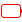
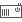

# openSUSE Icons for Plasma Workspace

Cute icons for Plasma workspace, Firefox, LibreOffice, etc.

## Design Guide

### Sizes

Size | Content size | Border width | Border radius | Usage
-----|--------------|--------------|---------------|------------
16   | 16           | 1            | 2 out, 1 in   | Pin icon
22*  | 20           | 1            | 3 out, 2 in   | Normal DPI
32*  | 28           | 1            | 4 out, 3 in   | HiDPI @1.5
44   | 40           | 2            | 6 out, 4 in   | HiDPI @2, scaled from 24
64   | 56           | 2            | 8 out, 6 in   | HiDPI @3, scaled from 32

Note: * most important sizes that need to be drawn

### Colors

Follow [openSUSE branding guidelines](https://opensuse.github.io/branding-guidelines/).

Name                  | Value
----------------------|--------
openSUSE Dark Gray    | `#555555`
openSUSE Light Gray   | `#cccccc`
openSUSE Green        | `#73ba25`
openSUSE Blue         | `#21a4df`
openSUSE Yellow       | `#f0c024`
openSUSE Red          | `#e0281f`

## Icons

### Plasma

Battery

Icon 22px | Icon 32px | Name
----------|-----------|-----
 |  | Fill100
 |  | Fill90
 |  | Fill80
 |  | Fill70
 |  | Fill60
 |  | Fill50
 |  | Fill40
 |  | Fill30
 |  | Fill20
 |  | Fill10
 |  | Fill0
 |  | AcAdapter (Decoration)
 |  | Unavailable (Decoration)
 |  | Battery
 |  | battery-ups